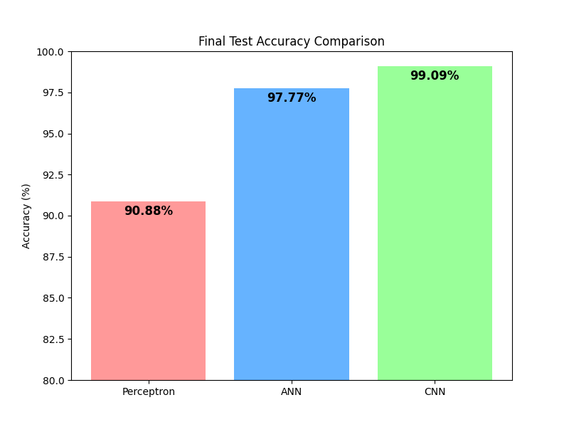
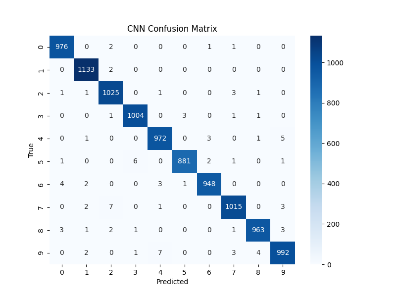

# CNN Image Classification Project

An end-to-end image classification project built around the MNIST handwritten digits dataset. The notebook compares three models - a perceptron, a fully connected neural network, and a convolutional neural network - to show how model architecture affects performance on the same task.

## Project Highlights

- Uses the MNIST dataset of grayscale handwritten digits from 0 to 9.
- Compares three approaches: perceptron, ANN, and CNN.
- Includes training curves, prediction samples, a CNN confusion matrix, and a final accuracy comparison chart.
- Demonstrates how convolutional layers improve performance on image data.

## Results Summary

The notebook reports the following final test accuracies:

| Model | Final Test Accuracy |
| --- | ---: |
| Perceptron | 90.88% |
| ANN | 97.77% |
| CNN | 99.09% |

The CNN delivers the best overall performance and is the recommended model for this project.

## Repository Contents

- `cnn_project.ipynb` - main notebook with data loading, preprocessing, model training, evaluation, and visualization.
- `perceptron_training.png` - training curves for the perceptron baseline.
- `ann_training.png` - training curves for the ANN model.
- `cnn_training.png` - training curves for the CNN model.
- `validation_accuracy_comparison.png` - validation accuracy comparison across all models.
- `cnn_confusion_matrix.png` - confusion matrix for the CNN predictions.
- `final_test_accuracy_comparison.png` - final test accuracy comparison chart.
- `model_predictions_comparison.png` - side-by-side prediction examples.
- `test_model_1.png` - sample model output image.

## Requirements

Install the following Python packages:

- `numpy`
- `pandas`
- `matplotlib`
- `seaborn`
- `scikit-learn`
- `tensorflow`
- `jupyter`

## How To Run

1. Open `cnn_project.ipynb` in Jupyter Notebook, JupyterLab, or VS Code.
2. Install the required packages if they are not already available.
3. Run the notebook cells from top to bottom.
4. Review the generated plots and evaluation outputs in the notebook and the saved image files.

Example installation command:

```bash
pip install numpy pandas matplotlib seaborn scikit-learn tensorflow jupyter
```

## Workflow Overview

1. Load the MNIST dataset.
2. Normalize and reshape the images.
3. Convert labels to categorical format.
4. Train and evaluate the perceptron baseline.
5. Train and evaluate the ANN.
6. Train and evaluate the CNN.
7. Compare model performance with plots and a confusion matrix.

## Visual Results

### Final Accuracy Comparison



### CNN Confusion Matrix



### Training Curves

- [Perceptron training](perceptron_training.png)
- [ANN training](ann_training.png)
- [CNN training](cnn_training.png)

## Notes

- The notebook uses the built-in MNIST dataset, so no manual dataset download is required.
- The project is best viewed in a notebook environment because it relies on interactive execution and inline plots.
- If you extend the project, consider adding data augmentation, early stopping, and model checkpointing for a more production-ready workflow.

## Next Improvements

- Add a `requirements.txt` file for reproducible environment setup.
- Export the trained model to disk for reuse in a separate inference script.
- Turn the notebook into a modular Python project with reusable training and evaluation functions.