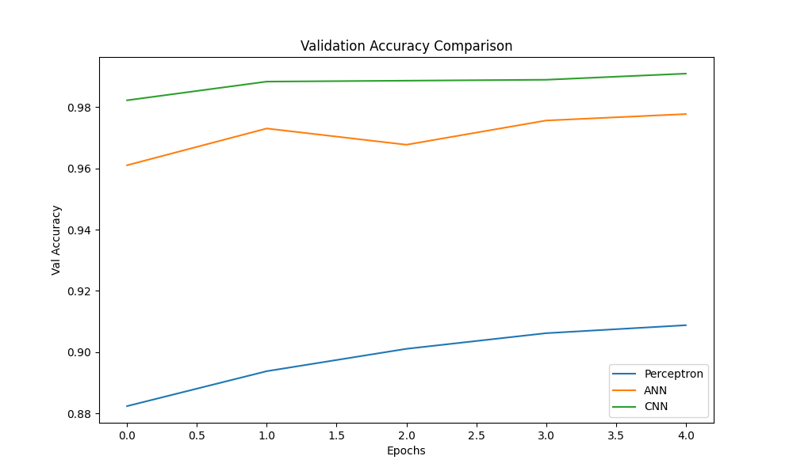
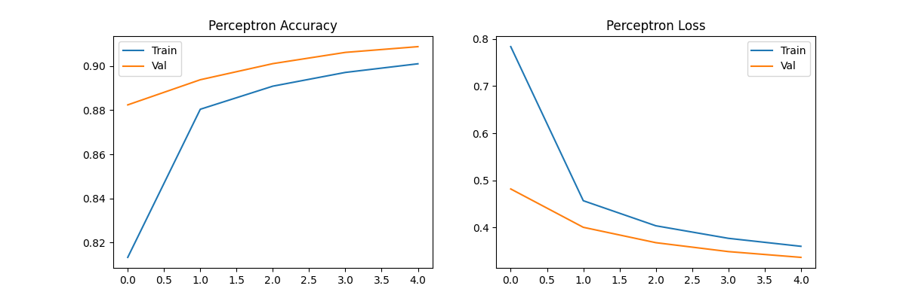
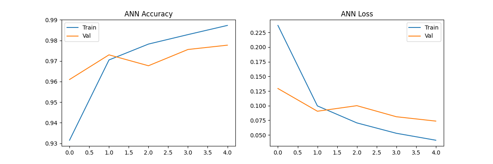
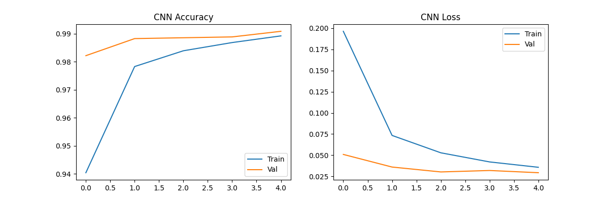

<div align="center">

# 🧠 CNN Image Classification — MNIST Digit Recognition

**A progressive deep learning study comparing Perceptron → ANN → CNN on handwritten digit classification**


</div>

---

## 📌 Overview

This project explores **how model architecture impacts image classification performance** using the MNIST handwritten digits dataset. Rather than jumping straight to a CNN, the experiment is designed progressively — starting from the simplest possible model and increasing complexity at each step — so every improvement is measurable and explainable.

Three architectures are trained and evaluated on identical data:

| # | Model | Architecture Type | Optimizer | Test Accuracy |
|---|-------|-------------------|-----------|:-------------:|
| 1 | **Perceptron** | Single-layer, no hidden units | SGD | 90.88% |
| 2 | **ANN** | Fully connected, 2 hidden layers | Adam | 97.77% |
| 3 | **CNN** | Conv2D + MaxPooling + Dropout | Adam | **99.09%** ✅ |

> **Key finding:** The CNN outperforms the Perceptron by over **8 percentage points** — not through hyperparameter tuning, but purely through architectural design choices.

---

## 📂 Repository Structure

```
📦 cnn-image-classification/
├── 📓 cnn_project.ipynb                  # Main notebook — full pipeline
├── 📊 perceptron_training.png            # Perceptron accuracy & loss curves
├── 📊 ann_training.png                   # ANN accuracy & loss curves
├── 📊 cnn_training.png                   # CNN accuracy & loss curves
├── 📊 validation_accuracy_comparison.png # All models val accuracy per epoch
├── 📊 cnn_confusion_matrix.png           # CNN confusion matrix (10×10)
├── 📊 final_test_accuracy_comparison.png # Final bar chart comparison
├── 🖼️  model_predictions_comparison.png  # Side-by-side prediction samples
└── 📄 README.md
```

---

## 🗂️ Dataset

**MNIST (Modified National Institute of Standards and Technology)**

| Property | Value |
|----------|-------|
| Source | `tensorflow.keras.datasets.mnist` (built-in, no download needed) |
| Training samples | 60,000 |
| Test samples | 10,000 |
| Image size | 28 × 28 pixels, grayscale |
| Classes | 10 (digits 0–9) |
| Label format | One-hot encoded via `to_categorical` |

**Preprocessing steps:**
- Pixel values normalized to `[0, 1]` by dividing by `255.0`
- Images reshaped to `(28, 28)` for Perceptron/ANN and `(28, 28, 1)` for CNN
- Labels converted to categorical using `to_categorical(y, 10)`

---

## 🏗️ Model Architectures

### 1. Perceptron (Baseline)
```
Input (784) → Flatten → Dense(10, softmax)
Optimizer: SGD | Loss: Categorical Cross-Entropy
```
A single-layer linear classifier. No hidden layers — pixels are mapped directly to class probabilities. Serves as the baseline to quantify the value of depth and convolution.

---

### 2. ANN — Artificial Neural Network
```
Input (784) → Flatten → Dense(128, ReLU) → Dense(64, ReLU) → Dense(10, softmax)
Optimizer: Adam | Loss: Categorical Cross-Entropy
```
Two hidden Dense layers introduce non-linearity via ReLU activation, allowing the network to learn more complex decision boundaries. Switching to Adam optimizer improves convergence speed significantly over SGD.

---

### 3. CNN — Convolutional Neural Network ⭐
```
Input (28,28,1)
  → Conv2D(32, 3×3, ReLU)
  → MaxPooling2D(2×2)
  → Conv2D(64, 3×3, ReLU)
  → MaxPooling2D(2×2)
  → Flatten
  → Dense(128, ReLU)
  → Dropout(0.5)
  → Dense(10, softmax)
Optimizer: Adam | Loss: Categorical Cross-Entropy
```
Convolutional layers learn **spatial hierarchies** — edges in the first layer, curves and strokes in the second — rather than treating each pixel as an independent feature. `MaxPooling2D` reduces spatial dimensions, cutting computation and adding translation invariance. `Dropout(0.5)` regularizes the dense head to prevent overfitting.

---

## 📈 Results & Visualizations

### Final Test Accuracy Comparison


### Validation Accuracy Across Epochs


> The CNN begins epoch 0 already above 98% validation accuracy, demonstrating how convolutional feature extraction generalizes immediately. The ANN shows slight oscillation around epoch 2, a mild sign of overfitting. The Perceptron plateaus early due to its architectural ceiling.

### CNN Confusion Matrix


> Near-perfect classification across all 10 digit classes. The most frequent misclassifications occur between visually similar pairs: **4 ↔ 9**, **3 ↔ 5**, and **7 ↔ 2** — patterns consistent with human perception of handwriting ambiguity.

### Training Curves

| Model | Training Curves |
|-------|----------------|
| Perceptron |  |
| ANN |  |
| CNN |  |

### Prediction Samples (Side-by-Side)


---

## ⚙️ Tech Stack

| Tool | Role |
|------|------|
| `TensorFlow 2.x` | Deep learning framework |
| `Keras Sequential API` | Model building |
| `NumPy` | Array operations & data manipulation |
| `Pandas` | Data handling |
| `Matplotlib` | Training curve visualization |
| `Seaborn` | Confusion matrix heatmap |
| `Scikit-learn` | Accuracy scoring, confusion matrix |
| `Jupyter Notebook` | Interactive development environment |

---

## 🚀 Getting Started

### Prerequisites
- Python 3.8+
- pip

### Installation

```bash
# 1. Clone the repository
git clone https://github.com/your-username/cnn-image-classification.git
cd cnn-image-classification

# 2. (Optional) Create a virtual environment
python -m venv venv
source venv/bin/activate        # macOS/Linux
venv\Scripts\activate           # Windows

# 3. Install dependencies
pip install -r requirements.txt
```

### Run the Notebook

```bash
jupyter notebook cnn_project.ipynb
```

Or open directly in **VS Code**, **JupyterLab**, or **Google Colab**.

> **Note:** The MNIST dataset is fetched automatically via `keras.datasets.mnist` — no manual download required.

---

## 📋 Requirements

```txt
numpy
pandas
matplotlib
seaborn
scikit-learn
tensorflow>=2.0
jupyter
```

Install all at once:

```bash
pip install numpy pandas matplotlib seaborn scikit-learn tensorflow jupyter
```

---

## 🔄 Workflow Overview

```
1. Load MNIST Dataset (60k train / 10k test)
        ↓
2. Preprocess — Normalize [0,1], Reshape, One-hot Encode Labels
        ↓
3. Train Perceptron → Evaluate → Log Accuracy
        ↓
4. Train ANN → Evaluate → Log Accuracy
        ↓
5. Train CNN → Evaluate → Log Accuracy
        ↓
6. Compare — Training curves, Validation accuracy, Confusion matrix, Bar chart
```

---

## 🔍 Key Learnings

- **Architecture is the first hyperparameter.** An 8-point accuracy jump was achieved with zero data changes — only architectural decisions differed.
- **Convolutional layers encode the right inductive bias for images.** Dense layers treat pixels independently; Conv2D layers reason about spatial structure.
- **Adam > SGD for deeper networks.** Adam's adaptive learning rates consistently converged faster and to better minima.
- **Dropout is meaningful regularization.** Dropout(0.5) on the CNN's dense head prevented the training/validation gap seen in the ANN.
- **Validation accuracy from epoch 0 matters.** The CNN's high starting validation accuracy signals genuine generalization, not just memorization.

---

## 🛣️ Roadmap & Next Improvements

- [ ] Add `requirements.txt` for reproducible environment setup
- [ ] Export trained CNN to `SavedModel` / `.h5` for reuse in inference scripts
- [ ] Add **data augmentation** (rotation, zoom, shift) to stress-test generalization
- [ ] Implement **Early Stopping** and **ModelCheckpoint** callbacks
- [ ] Refactor notebook into a modular Python project (`train.py`, `evaluate.py`, `predict.py`)
- [ ] Add **Grad-CAM visualizations** to interpret what the CNN focuses on
- [ ] Experiment with **Batch Normalization** layers for faster, more stable training
- [ ] Deploy the CNN as a **REST API** using FastAPI or Flask

---

## 📄 License

This project is licensed under the MIT License — see the [LICENSE](LICENSE) file for details.

---

<div align="center">

**If this project helped you, consider giving it a ⭐ on GitHub!**

Made with 🧠 + ☕ | Deep Learning | Computer Vision | MNIST

</div>
